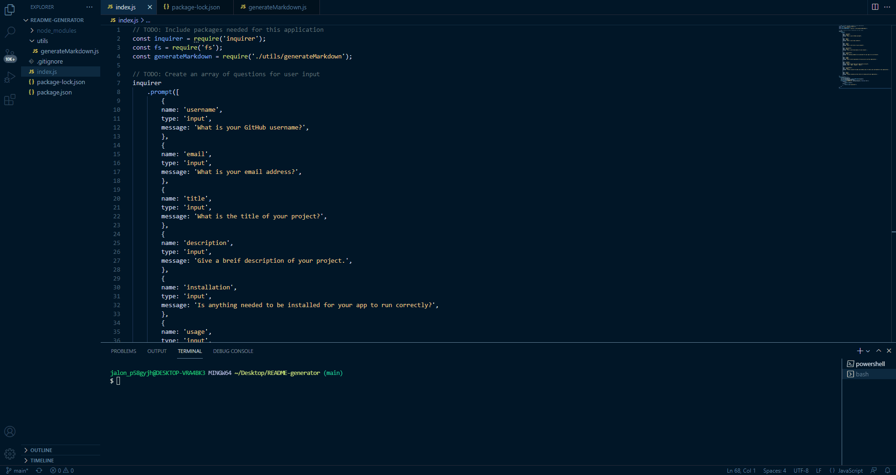

# README generator
  
  ## Description
 I can use this application to quickly and effectively create a professional README documents for future web applications that I develop.

 A link to watch a video on how the application works: 
  
  ## Table of Contents
  - [Installation](#installation)
  - [Usage](#usage)
  - [License](#license)
  - [Contributing](#contributing)
  - [Tests](#tests)
  - [Questions](#questions)
  
  ## Installation
  You need to run npm i inquirer to effectively use this application
 
  ## Usage
  I will use this application on all future projects to create the README files proffesionally and much easier that the way that I previously did.
  
  ## License
  
  ---
  ## Contributing 
  At this time there is no one to include in this section.
  
  ## Tests
  At this time there are no current tests ran on this application
 
  ## Questions
  If you have any further questions about my application, please feel free to contact me using the infromation below:
  jalontuttle
  jalontuttle@outlook.com
